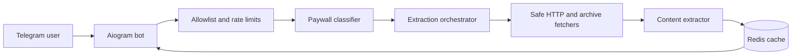

# Unpaywall Bot

[](https://github.com/anfixit/unpaywallbot/actions/workflows/ci.yml)
[](https://www.python.org/)
[](LICENSE)
[](https://github.com/anfixit/unpaywallbot/pkgs/container/unpaywallbot)

[Русская версия](README.ru.md)

Unpaywall Bot is an experimental Telegram application for studying how article pages and client-side access controls are implemented. It classifies a publication, attempts to extract text that is publicly delivered by the target site or a public archive, and returns a readable result.

> [!IMPORTANT]
> This repository is a research and engineering project, not a subscription replacement. It does not grant access rights to content. Use it only for URLs and content you are legally authorized to access, and respect copyright, publisher terms, robots policies, and applicable law.

## Project status

The bot is suitable for controlled self-hosted testing. Publication layouts, anti-bot systems, archive availability, and access rules change frequently, so a domain entry in `data/paywall_map.yaml` is not a guarantee that a specific article will be extracted.

Authenticated browser extraction exists as an isolated experimental component, but it is not enabled by the default bot runtime.

## Features

- Asynchronous Telegram bot based on Aiogram 3
- YAML-driven publication and paywall classification
- Public HTML, crawler-view, archive, and domain-specific extraction strategies
- Readability, JSON-LD, and semantic HTML content extraction
- Redis cache, FSM storage, and atomic rate limiting
- Private-by-default production access with an explicit allowlist
- SSRF validation for initial requests and redirects, including private networks, IP literals, credentials, and non-standard ports
- Bounded request duration, redirects, decoded response size, processes, memory, and container logs
- Privacy-preserving access logs with pseudonymous user identifiers
- Reproducible Docker image and hardened Docker Compose stack
- Blocking lint, type, test, dependency, security, and Docker build checks

## Non-goals

The default application does not:

- bypass DRM, CAPTCHA, account entitlement, or server-side authorization
- provide publisher credentials or shared subscription accounts
- guarantee complete text for every configured publication
- accept URLs targeting localhost, private networks, cloud metadata services, or arbitrary ports
- expose Redis or an HTTP service to the public internet

## Architecture



The bot uses Telegram long polling. It does not require an inbound web port.

## Requirements

- Python 3.12
- [uv](https://docs.astral.sh/uv/)
- Redis 7
- Chromium through Playwright for optional headless methods
- Docker Engine with Docker Compose for the production stack

## Local development

```bash
git clone https://github.com/anfixit/unpaywallbot.git
cd unpaywallbot

cp .env.example .env.local
# Edit BOT_TOKEN and ENCRYPTION_KEY.
# For local Redis, set REDIS_URL=redis://localhost:6379/0.

docker run --rm -d \
  --name unpaywallbot-redis \
  -p 127.0.0.1:6379:6379 \
  redis:7-alpine

uv sync --locked --all-extras
uv run playwright install chromium
uv run python -m bot.main
```

Generate an encryption secret with:

```bash
python -c "import secrets; print(secrets.token_urlsafe(48))"
```

## Docker Compose

```bash
cp .env.example .env.production
```

Edit `.env.production` and set at least:

```dotenv
BOT_TOKEN=...
ENCRYPTION_KEY=...
ENV=production
ALLOWED_USERS=[123456789]
PUBLIC_ACCESS=false
```

Then start the stack:

```bash
docker compose up -d --build
docker compose ps
docker compose logs -f bot
```

Redis is available only on the private Compose network. The bot container runs as an unprivileged user with a read-only root filesystem, dropped Linux capabilities, resource limits, health checks, and log rotation.

## Configuration

| Variable | Required | Default | Description |
| --- | :---: | --- | --- |
| `BOT_TOKEN` | yes | - | Telegram token from BotFather |
| `ENCRYPTION_KEY` | yes | - | Random secret with at least 32 characters |
| `REDIS_URL` | no | `redis://localhost:6379/0` | Redis connection URL |
| `ALLOWED_USERS` | production* | `[]` | JSON array of allowed Telegram user IDs |
| `PUBLIC_ACCESS` | no | `false` | Explicitly allow all Telegram users |
| `ENV` | no | `development` | `development`, `testing`, or `production` |
| `LOG_LEVEL` | no | `INFO` | Application log level |
| `REQUEST_TIMEOUT_SECONDS` | no | `90` | Overall processing timeout, from 10 to 300 seconds |
| `LOG_USER_IDENTIFIERS` | no | `false` | Store raw Telegram identifiers in access logs |
| `TELEGRAPH_ENABLED` | no | `false` | Publish long extracted text to the third-party Telegraph service |

* Production requires either a non-empty `ALLOWED_USERS` value or `PUBLIC_ACCESS=true`.

Secrets must never be committed. `.env`, `.env.local`, and `.env.production` are ignored by Git.

### Third-party publishing

`TELEGRAPH_ENABLED` is disabled by default. When enabled, long extracted
text, its title, author, and source URL are sent to the third-party
Telegraph service. Enable it only when this transfer is appropriate for
your deployment and users. When it is disabled, long text is split into
Telegram messages instead.

## Publication configuration

`data/paywall_map.yaml` maps domains to classification and extraction strategies. The map is an experimental compatibility catalog, not a service-level guarantee.

When adding or changing an entry:

1. document the expected public behavior
2. add unit tests with stored or synthetic HTML
3. avoid live tests that depend on subscriber-only content
4. do not add credentials, cookies, or copyrighted article copies to the repository

## Quality checks

```bash
uv sync --locked --all-extras
uv run ruff check bot tests scripts
uv run mypy bot
uv run pytest
uvx bandit -r bot -q
uv export --locked --no-dev \
  --format requirements-txt \
  --output-file requirements-audit.txt
uvx pip-audit -r requirements-audit.txt
docker build -t unpaywallbot:local .
```

The same checks run in `.github/workflows/ci.yml`. Pull requests cannot publish or deploy production images.

## Deployment

Production images are published to GHCR only after the `CI` workflow succeeds on `main`. Server deployment is disabled until the repository variable `DEPLOY_ENABLED` is set to `true`.

See [docs/DEPLOYMENT.md](docs/DEPLOYMENT.md) for the server account, SSH, GitHub environment, secrets, rollback, and verification procedure.

## Repository layout

```text
bot/
  auth/          optional encrypted account storage
  handlers/      Telegram commands and URL processing
  middleware/    access control, rate limiting, audit logging
  security/      SSRF and outbound network controls
  services/      classification, extraction, cache orchestration
  storage/       Redis integration
data/            publication map and runtime data directories
docs/            architecture, deployment, and audit reports
scripts/         maintenance and diagnostic commands
tests/           unit and integration tests
```

## Security

Do not report vulnerabilities in public issues. Follow [SECURITY.md](SECURITY.md).

The current production-readiness review is documented in [docs/AUDIT.md](docs/AUDIT.md).

## Contributing

Contributions are welcome. Read [CONTRIBUTING.md](CONTRIBUTING.md), follow the [Code of Conduct](CODE_OF_CONDUCT.md), and open a focused pull request with tests.

General usage questions belong in [GitHub Discussions](https://github.com/anfixit/unpaywallbot/discussions) when enabled. Other support options are listed in [SUPPORT.md](SUPPORT.md).

## License

Copyright (c) anfixit.

The project is licensed under the [GNU Affero General Public License v3.0](LICENSE). If you run a modified version as a network service, review the corresponding source availability obligations in the license.
