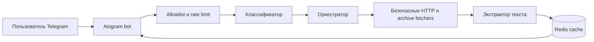

# Unpaywall Bot

[](https://github.com/anfixit/unpaywallbot/actions/workflows/ci.yml)
[](https://www.python.org/)
[](LICENSE)

[English version](README.md)

Unpaywall Bot - экспериментальный Telegram-бот для исследования структуры новостных страниц и клиентских ограничений доступа. Бот классифицирует сайт, пытается извлечь текст, который публично отдан сайтом или доступен в публичном архиве, и возвращает его в читаемом виде.

> [!IMPORTANT]
> Проект не заменяет подписку и не даёт права доступа к контенту. Используйте его только для ссылок и материалов, к которым у вас есть законный доступ. Соблюдайте авторское право, правила сайтов и применимое законодательство.

## Статус

Проект подходит для контролируемого самостоятельного хостинга и тестирования. Разметка сайтов, антибот-защита, архивы и правила доступа часто меняются. Наличие домена в `data/paywall_map.yaml` не гарантирует получение конкретной статьи.

Модуль авторизованного headless-браузера существует как изолированный экспериментальный компонент, но в стандартном runtime бота не включён.

## Возможности

- асинхронный Telegram-бот на Aiogram 3
- классификация сайтов и типов ограничений через YAML
- извлечение из публичного HTML, crawler-view и публичных архивных снимков
- Readability, JSON-LD и семантический HTML
- Redis-кеш, FSM storage и атомарный rate limit
- закрытый по умолчанию production с allowlist
- SSRF-проверка исходных URL и редиректов
- блокировка localhost, приватных сетей, IP-адресов, credentials и нестандартных портов
- общие таймауты, лимиты редиректов, декодированного ответа и ресурсов контейнера
- псевдонимизированные access-логи
- воспроизводимый Docker-образ и защищённый Docker Compose
- обязательные проверки lint, types, tests, dependencies, security и Docker build

## Что проект не делает

Стандартная конфигурация:

- не обходит DRM, CAPTCHA и серверную авторизацию
- не содержит общих подписочных аккаунтов
- не гарантирует полный текст для каждого сайта
- не принимает URL внутренних сервисов и произвольных портов
- не публикует Redis или HTTP-порт в интернет

## Архитектура



Бот использует Telegram long polling. Входящий веб-порт ему не нужен.

## Локальный запуск

Требуются Python 3.12, uv и Redis 7.

```bash
git clone https://github.com/anfixit/unpaywallbot.git
cd unpaywallbot

cp .env.example .env.local
# Укажите BOT_TOKEN и ENCRYPTION_KEY.
# Для локального Redis:
# REDIS_URL=redis://localhost:6379/0

docker run --rm -d \
  --name unpaywallbot-redis \
  -p 127.0.0.1:6379:6379 \
  redis:7-alpine

uv sync --locked --all-extras
uv run playwright install chromium
uv run python -m bot.main
```

Генерация секрета:

```bash
python -c "import secrets; print(secrets.token_urlsafe(48))"
```

## Docker Compose

```bash
cp .env.example .env.production
```

Минимальная production-конфигурация:

```dotenv
BOT_TOKEN=...
ENCRYPTION_KEY=...
ENV=production
ALLOWED_USERS=[123456789]
PUBLIC_ACCESS=false
```

Запуск:

```bash
docker compose up -d --build
docker compose ps
docker compose logs -f bot
```

Redis доступен только во внутренней Docker-сети. Бот работает от непривилегированного пользователя с read-only root filesystem, удалёнными Linux capabilities, healthcheck, лимитами ресурсов и ротацией логов.

## Переменные окружения

| Переменная | Обязательна | По умолчанию | Назначение |
| --- | :---: | --- | --- |
| `BOT_TOKEN` | да | - | Токен Telegram от BotFather |
| `ENCRYPTION_KEY` | да | - | Случайный секрет длиной от 32 символов |
| `REDIS_URL` | нет | `redis://localhost:6379/0` | Адрес Redis |
| `ALLOWED_USERS` | production* | `[]` | JSON-массив Telegram user_id |
| `PUBLIC_ACCESS` | нет | `false` | Явно открыть бота всем пользователям |
| `ENV` | нет | `development` | `development`, `testing` или `production` |
| `LOG_LEVEL` | нет | `INFO` | Уровень логирования |
| `REQUEST_TIMEOUT_SECONDS` | нет | `90` | Общий таймаут обработки от 10 до 300 секунд |
| `LOG_USER_IDENTIFIERS` | нет | `false` | Хранить raw Telegram identifiers в логах |
| `TELEGRAPH_ENABLED` | нет | `false` | Передавать длинный текст во внешний сервис Telegraph |

* В production нужен непустой `ALLOWED_USERS` или `PUBLIC_ACCESS=true`.

Секреты нельзя коммитить. `.env`, `.env.local` и `.env.production` исключены из Git.

### Публикация во внешнем сервисе

`TELEGRAPH_ENABLED` по умолчанию выключена. При включении длинный текст,
заголовок, автор и исходный URL передаются во внешний сервис Telegraph.
Включайте эту функцию только там, где такая передача допустима. Когда она
выключена, длинный текст разбивается на несколько сообщений Telegram.

### Публичные архивы

Адаптер читает только уже существующие снимки и не создаёт новые. Сначала
он проверяет archive.ph через опциональный прокси. Если сервис показывает
антибот-проверку, блокирует запрос или не содержит подходящего снимка, бот
автоматически пробует ближайший HTML-снимок в Wayback Machine.

CAPTCHA не решается и не пересылается пользователю. Если оба безопасных
автоматических способа исчерпаны, бот сохраняет контекст запроса и
показывает кнопки для открытия Wayback Machine или повторного поиска без
повторной отправки ссылки.

## Карта сайтов

`data/paywall_map.yaml` связывает домены с классификацией и стратегиями извлечения. Это экспериментальный каталог совместимости, а не гарантия работоспособности.

Для нового или изменённого сайта:

1. опишите ожидаемое публичное поведение
2. добавьте unit-тесты на сохранённом или синтетическом HTML
3. не добавляйте live-тесты, зависящие от платной статьи
4. не коммитьте credentials, cookies и копии защищённых статей

## Проверки

```bash
uv sync --locked --all-extras
uv run ruff check bot tests scripts
uv run mypy bot scripts
uv run pytest
uvx bandit -r bot -q
uv export --locked --no-dev \
  --format requirements-txt \
  --output-file requirements-audit.txt
uvx pip-audit -r requirements-audit.txt
docker build -t unpaywallbot:local .
```

Те же проверки выполняет `.github/workflows/ci.yml`. Pull request не имеет доступа к production-секретам и не может выполнить деплой.

## Деплой

Production-образ публикуется в GHCR только после успешного `CI` на ветке `main`. Серверный деплой отключён, пока repository variable `DEPLOY_ENABLED` не установлена в `true`.

Полная схема пользователя deploy, SSH, GitHub Environment, секретов, проверки и отката описана в [docs/DEPLOYMENT.md](docs/DEPLOYMENT.md).

## Безопасность и участие

- уязвимости: [SECURITY.md](SECURITY.md)
- правила участия: [CONTRIBUTING.md](CONTRIBUTING.md)
- кодекс поведения: [CODE_OF_CONDUCT.md](CODE_OF_CONDUCT.md)
- поддержка: [SUPPORT.md](SUPPORT.md)
- encrypted storage: [docs/ACCOUNT_STORAGE.md](docs/ACCOUNT_STORAGE.md)
- отчёт аудита: [docs/AUDIT.md](docs/AUDIT.md)

## Лицензия

Проект распространяется по [GNU Affero General Public License v3.0](LICENSE). При запуске изменённой версии как сетевого сервиса учитывайте требования лицензии о доступности соответствующего исходного кода.
